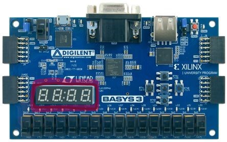
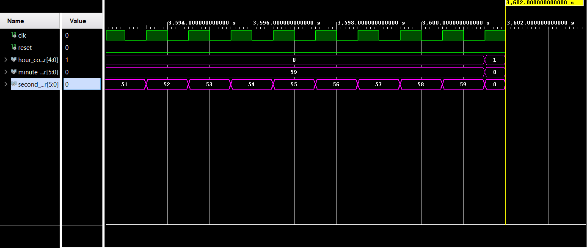
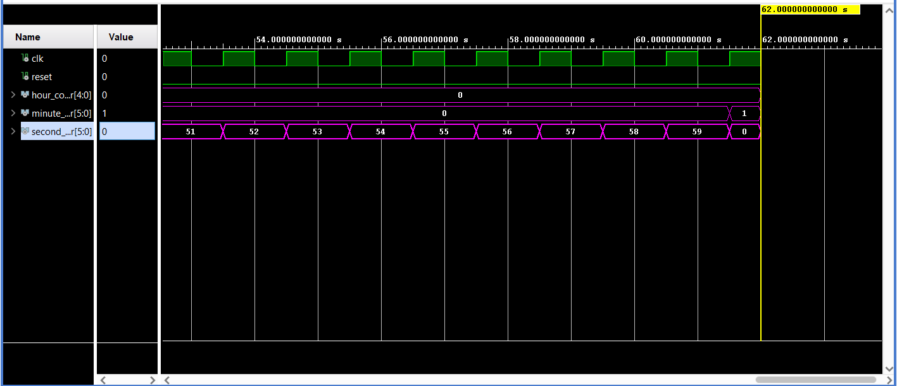
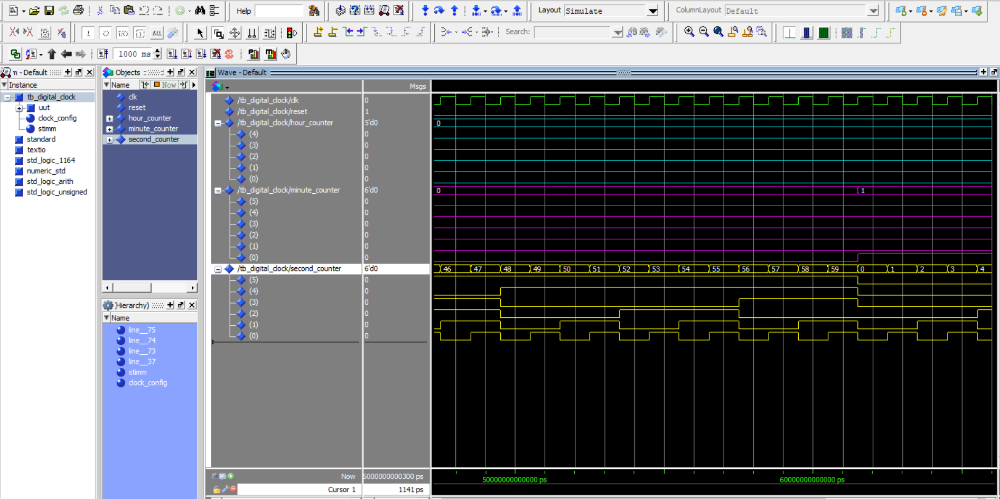
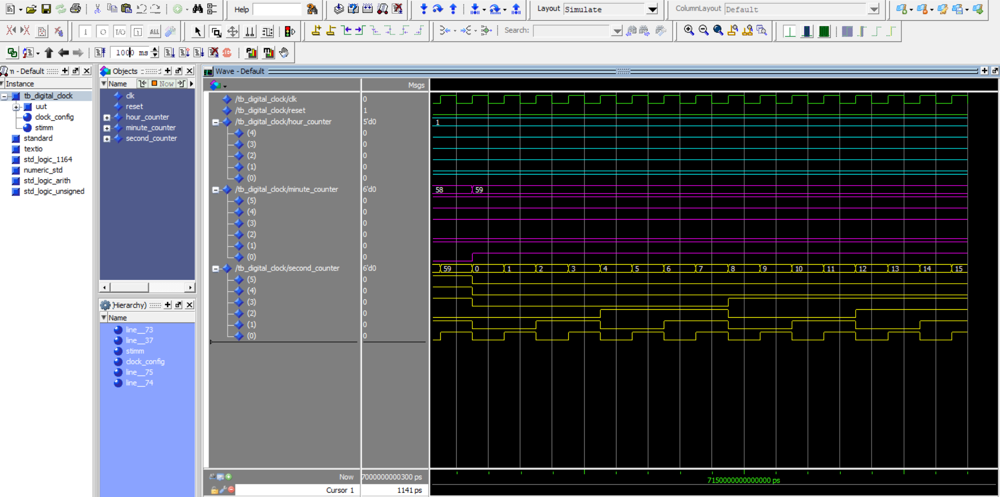

# Digital-Clock-HH.MM.SS-FPGA
Design Digital Clock ( HH.MM.SS) with VHDL / FPGA



FPGA üzerinde seven segment display kullanmadan bir clock periyodunun ayarlanmasıyla saat, dakika, saniye olarak bir dijital saat tasarımı, algoritmayı anlamanızda yardımcı olacaktır. 

The algorithm primarily consists of a simple if-elsif-else structure. This structure first checks the seconds: if second < 59, it increments the seconds by 1. Otherwise, it moves to the else condition, where it resets the seconds and increments the minutes by 1. The same process applies to the hours as well. This way, a basic digital clock design is achieved, capable of counting up to 23:59:59. Below, I will also share the test bench section. When running the program in simulation, you can observe that the minutes increment successfully when the seconds reach 59, and the hours increment by 1 when the minutes reach 59. You can also find the simulation results below.

The only point to pay attention to is type conversions. Many people attempt to perform arithmetic operations or comparisons on bit arrays defined as std_logic_vector, which inevitably results in errors. To avoid this, you need to understand which types are used for specific operations. For this project, for instance, after defining the types as std_logic_vector, these types were assigned to internal signals as unsigned. The necessary comparisons and arithmetic operations were then performed, and finally, the types were converted back from unsigned to std_logic_vector.

Don’t forget to use the 'IEEE.std_logic_unsigned' library! 😊

[SECOND => MUNİTE TRANSITION ( VIVADO)]



[MUNITE => HOUR TRANSITION ( VIVADO) ]



[SECOND => MUNITE TRANSITION (MODELSIM)]



[MUNITE => HOUR TRANSITION (MODELSIM)]



TEST BENCH => DIGITAL CLOCK
```
    

library IEEE;
use IEEE.STD_LOGIC_1164.ALL;


entity tb_digital_clock is
--  Port ( );
end tb_digital_clock;

architecture Behavioral of tb_digital_clock is

component digital_clock is

		port ( 
					clk 		: 		in std_logic;
					reset 		: 		in std_logic;
					---------------------------------
					hour_counter 		: 		out std_logic_vector ( 4 downto 0 );
					minute_counter 		:  		out std_logic_vector ( 5 downto 0 );
					second_counter 		: 		out std_logic_vector ( 5 downto 0 )
			 );	
end component;

signal clk : std_logic;
signal reset : std_logic;
signal hour_counter : std_logic_vector(4 downto 0)   := (others => '0');
signal minute_counter : std_logic_vector(5 downto 0) := (others => '0');
signal second_counter : std_logic_vector(5 downto 0) := (others => '0');


begin

    
uut : digital_clock port map(

            clk => clk,
            reset => reset,
            hour_counter => hour_counter,
            minute_counter => minute_counter,
            second_counter => second_counter

);

clock_config : process
begin

       clk <= '0';
       wait for 0.5 sec;
       clk <= '1';
       wait for 0.5 sec;
    
end process;

stimm : process
    begin
    
        reset <= '1' ;
        wait for 2 sec;
        reset <= '0';
        wait for 20 sec;
        wait;

end process;

end Behavioral;
```


If you'd like to improve yourself further, you can take this to the next level by adding milliseconds. Additionally, if you have an FPGA board, you can implement this algorithm on seven-segment displays...
